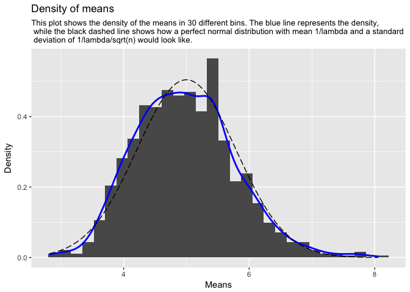

# Statistical Inference: Course Project Part 1
S. Servaes  
17 August 2017  


## Part 1: Simulation Exercise Instructions

In this project you will investigate the exponential distribution in R and compare it with the Central Limit Theorem. The exponential distribution can be simulated in R with rexp(n, lambda) where lambda is the rate parameter. The mean of exponential distribution is 1/lambda and the standard deviation is also 1/lambda. Set lambda = 0.2 for all of the simulations. You will investigate the distribution of averages of 40 exponentials. Note that you will need to do a thousand simulations.

Illustrate via simulation and associated explanatory text the properties of the distribution of the mean of 40 exponentials. You should

* Show the sample mean and compare it to the theoretical mean of the distribution.
* Show how variable the sample is (via variance) and compare it to the theoretical variance of the distribution.
* Show that the distribution is approximately normal.

In point 3, focus on the difference between the distribution of a large collection of random exponentials and the distribution of a large collection of averages of 40 exponentials.

### 1. Simulations
First we will generate the required distributions. One exponential distribution with a lambda of 0.2 containing 1000 samples named `samples` will be generated. Furthermore, a distribution containing 1000 averages of 40 samples from an exponential distribution with a lambda of 0.2, will be generated as well.

```r
# Assign the variables
set.seed(2017)
n = 40
lambda = 0.2
mns = NULL

# Simulate 1000 samples of an exponential distribution with lambda
samples <- rexp(1000, lambda)

# Simulate 1000 times the average of 40 samples from an exponential distribution with lambda
for(i in 1:1000){
        mns = c(mns, mean(rexp(n, lambda)))
}
```

### 2. Sample Mean versus Theoretical Mean.

In order to answer the first question, the means are calculated for the distributions.  
Also a few plots are quickly made


```r
# Calculate the means of the 2 distributions
mean_samples <- mean(samples)
mean_mns <- mean(mns)

hist(samples, breaks = 20, main = "Histogram of Samples", xlab = "Samples")
abline(v = mean(samples), col = "red", lwd = "2")
text(mean(samples) + 5, 320, paste("Mean = ", round(mean(samples),2)), col = "red")
```

<!-- -->

```r
hist(mns, breaks = 20, main = "Histogram of means", xlab = "Means")
abline(v = mean(mns), col = "red", lwd = "2")
text(mean(mns) + 0.6, 99, paste("Mean = ", round(mean(mns),2)), col = "red")
```

<!-- -->

The theoretical mean of the samples distribution is 5.  
The simulated samples have a mean of 5.05.  

The theoretical mean of the means distribution has a mean of 5.  
The simulated means distribution has a mean of 4.98.

### 3. Sample Variance versus Theoretical Variance.

In order to answer the second question, the variances are calculated for the distributions.


```r
var_samples <- var(samples)
var_mns <- var(mns)
```

The theoretical variance of the exponential distribution is 25.  
The simulated variances have a mean of 25.08.  

The theoretical mean of the means distribution has a mean of 0.62.   
The simulated means distribution has a mean of 0.62.  

### 3. Distribution.

The code below generates normal distribution with a similar mean and sd to compare to the distribution of the means.
This distribution will be plotted (dashed line) over the fitted distribution of the means (blue line).
Furthermore, this code will plot a qqplot of the distribution of the means to assess its normality.


```r
# generate a sequence of lenght 100
xfit <- seq(min(mns), max(mns), length=100)

# generate a normal distribution of this sequence
yfit <- dnorm(xfit, mean=1/lambda, sd=(1/lambda/sqrt(n)))

# Make a histogram of the means distribution and compare the fit to the normal distribution
caption <- "This plot shows the density of the means in 30 different bins. The blue line represents the density, while the black dashed line shows how a perfect normal distribution with mean 1/lambda and a standard deviation of 1/lambda/sqrt(n) would look like."
caption <- paste(strwrap(caption, 105), sep="", collapse=" \n ")

ggplot(data = as.data.frame(mns), aes(mns)) + 
        geom_histogram(bins = 30, aes(y = ..density..)) +
        labs(title = "Density of means", subtitle = caption) +
        xlab("Means") +
        ylab("Density") +
        geom_line(stat = "density", aes(mns), col = "blue", size = 1) +
        geom_line(data = as.data.frame(xfit), aes(xfit, yfit), linetype = 5)
```

<!-- -->

```r
# Generate a qq plot
qqnorm(mns, pch = 20, main = "Q-Q plot of means")
qqline(mns, col = "red", lwd = "2")
```

<!-- -->

From the histograms and the qqplot it is clearly visible that the distribution of means has a gaussian distribution that approaches a normal distribution. This is to be expected because of the Central Limit Theorem stating that, in most situations, when independent random variables are added, their properly normalized sum tends toward a normal distribution (a bell curve) even if the original variables themselves are not normally distributed.
