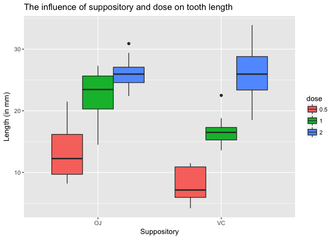

# Statistical Inference: Course Project Part 2
S. Servaes  
17 August 2017  


In this analysis we evaluate the effect of vitamin C on tooth growth in guinea pigs using the ToothGrowth dataset. This dataset contains the growth of odontoblasts (teeth) in each of 10 guinea pigs after administration of three different dose levels of Vitamin C (0.5, 1, and 2 mg) with each of two delivery methods, orange juice (OJ) or ascorbic acid (VC).

## 1. Load in the data


```r
tooth <- ToothGrowth
```

## 2. Summarise the data

First we briefly summarise the data and how this data is constructed.


```r
# Show how the data is constructed
str(tooth)
```

```
## 'data.frame':	60 obs. of  3 variables:
##  $ len : num  4.2 11.5 7.3 5.8 6.4 10 11.2 11.2 5.2 7 ...
##  $ supp: Factor w/ 2 levels "OJ","VC": 2 2 2 2 2 2 2 2 2 2 ...
##  $ dose: num  0.5 0.5 0.5 0.5 0.5 0.5 0.5 0.5 0.5 0.5 ...
```

```r
# Make dose a factor variable
tooth$dose <- as.factor(tooth$dose)

# Provide a basic summary
tooth %>% group_by(dose, supp) %>% summarise(mean = mean(len), sd = sd(len))
```

```
## # A tibble: 6 x 4
## # Groups:   dose [?]
##     dose   supp  mean       sd
##   <fctr> <fctr> <dbl>    <dbl>
## 1    0.5     OJ 13.23 4.459709
## 2    0.5     VC  7.98 2.746634
## 3      1     OJ 22.70 3.910953
## 4      1     VC 16.77 2.515309
## 5      2     OJ 26.06 2.655058
## 6      2     VC 26.14 4.797731
```

Next we plot the dataset, arranging the data by supp and dose.


```r
# Plot the dataset
ggplot(tooth, aes(supp, len)) + 
        geom_boxplot(aes(fill = dose)) + 
        xlab("Suppository") +
        ylab("Length (in mm)") +
        ggtitle("The influence of suppository and dose on tooth length")
```

<!-- -->

## 3. Test the effect of dose and suppository

The code belows subsets the `ToothGrowth` datset in different subsets, in order to test the effect of dose and suppository. The subsets are constructed so that each dose and method of administration is unique to each group.
Next t-tests were performed to compare the data between the groups. In total 7 t-tests are done to test the difference between:

* 0.5 OJ vs 1.0 OJ
* 1.0 OJ vs 2.0 OJ
* 0.5 VC vs 1.0 VC
* 1.0 VC vs 2.0 VC
* 0.5 OJ vs 0.5 VC
* 1.0 OJ vs 1.0 VC
* 2.0 OJ vs 2.0 VC

The p-values from these tests will then be stored in a variable `p_sum`.
As we perform multiple t-tests, a correction for multiple comparisons will be done using the Bonferroni method.
If the adjusted p-value was below 0.05, the null hypothesis can be rejected and there is a significant difference present between the 2 compared groups.


```r
# Construct the subsets by filtering per dose and supp
OJ_05 <- filter(tooth, dose == 0.5 & supp == "OJ")
OJ_10 <- filter(tooth, dose == 1 & supp == "OJ")
OJ_20 <- filter(tooth, dose == 2 & supp == "OJ")

VC_05 <- filter(tooth, dose == 0.5 & supp == "VC")
VC_10 <- filter(tooth, dose == 1 & supp == "VC")
VC_20 <- filter(tooth, dose == 2 & supp == "VC")

# Perform t-tests on the subsets
test_OJ_05_10 <- t.test(OJ_05$len, OJ_10$len)
test_OJ_10_20 <- t.test(OJ_10$len, OJ_20$len)

test_VC_05_10 <- t.test(VC_05$len, VC_10$len)
test_VC_10_20 <- t.test(VC_10$len, VC_20$len)

test_OJ_VC_05 <- t.test(OJ_05$len, VC_05$len)
test_OJ_VC_10 <- t.test(OJ_10$len, VC_10$len)
test_OJ_VC_20 <- t.test(OJ_20$len, VC_20$len)

# Collect the p-values from the t-tests
sum_p <- as.data.frame(cbind(c(test_OJ_05_10$data.name, test_OJ_10_20$data.name, test_VC_05_10$data.name, test_VC_10_20$data.name, test_OJ_VC_05$data.name, test_OJ_VC_10$data.name, test_OJ_VC_20$data.name),  c(test_OJ_05_10$p.value, test_OJ_10_20$p.value, test_VC_05_10$p.value, test_VC_10_20$p.value, test_OJ_VC_05$p.value, test_OJ_VC_10$p.value, test_OJ_VC_20$p.value)), stringsAsFactors = FALSE)

# Adjust the column names
colnames(sum_p) <- c("test", "p_value")

# Correct for multiple comparisons
sum_p$adjusted_p <- round(p.adjust(sum_p$p_value, method = "bonferroni"), 4)

# For a better overview, display the significant differences
sum_p$significant <- sum_p$adjusted_p < 0.05

# Display the result
sum_p
```

```
##                      test                 p_value adjusted_p significant
## 1 OJ_05$len and OJ_10$len    0.000087849190551615     0.0006        TRUE
## 2 OJ_10$len and OJ_20$len      0.0391951420462442     0.2744       FALSE
## 3 VC_05$len and VC_10$len 0.000000681101770286506     0.0000        TRUE
## 4 VC_10$len and VC_20$len   0.0000915560305663865     0.0006        TRUE
## 5 OJ_05$len and VC_05$len      0.0063586067640968     0.0445        TRUE
## 6 OJ_10$len and VC_10$len     0.00103837587229988     0.0073        TRUE
## 7 OJ_20$len and VC_20$len       0.963851588723373     1.0000       FALSE
```

## 4. Conclusions

The effect on tooth growth is significantly larger (p < 0.05) when the dosage of supplement is increased from 0.5 mg to 1.0 mg, for both delivery methods. At lower dosages (0.5 and 1.0 mg) the OJ delivery method appears to be more effective, as the length of tooth growth is significantly lower when the supplement is administered through VC. At a higher dosage (2.0 mg) there is no significant difference present between the 2 delivery methods. The highest dosage also has the largest effect on tooth growth, with a mean of 26.06  +/-  2.66  mg for the OJ delivery method and a mean of 26.14  +/-  4.8  mg for the VC delivery method. Although this high dose does not significantly differ (p > 0.05) from the medium dose in the OJ delivery method, this is the case for the VC delivery method.
